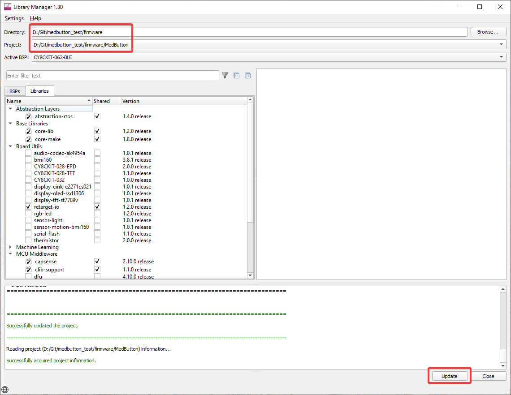
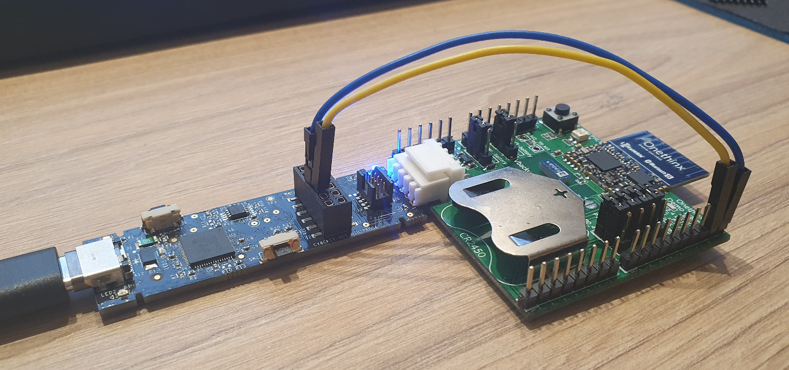

# First MedButton LoRa project in MTB2.3 environment

This project contain base project for MedButton development. In this project we are finaly able to have all needed for us parts such as:
- FreeRTOS
- GPS code
- GSM code
- LoRa code
- other

Warning: Module can't be debugged for first launch after connection. Problem is that host trying to aquire device before powering it up. So you need just restart debug after failure.

## What is needed to start
- With help of `C:\Users\YOUR_USER\ModusToolbox\tools_2.3\library-manager\library-manager.exe` open `firmware` Directory and `MedButton` project and update libraries with `Update` button:

- Inside `\firmware\MedButton\` call `make vscode` with ModusShell (or cygwin) 
- Open project in VSCode by calling `code MedButton_First.code-workspace` inside `/firmware/MedButton` with ModusShell (or cygwin)
- In `.vscode/launch.json` Replace `"Launch PSoC6 CM4 (KitProg3_MiniProg4)"` configuration with next:
```
{
    "name": "Launch PSoC6 CM4 (KitProg3_MiniProg4)",
    "type": "cortex-debug",
    "request": "launch",
    "cwd": "${workspaceRoot}",
    "executable": "./build/CY8CKIT-062-BLE/Debug/MedButton_First.elf",
    "servertype": "openocd",
    "searchDir": [
        "${workspaceRoot}",
        "${config:modustoolbox.toolsPath}/openocd/scripts/"
    ],
    "openOCDPreConfigLaunchCommands": [
        "set PROGRAMMER kitprog3",
        "set ENABLE_ACQUIRE 0",
        "set ENABLE_CM0 0"
    ],
    "configFiles": [
        "openocd.tcl"
    ],
    "overrideLaunchCommands": [
        "set mem inaccessible-by-default off",
        "-enable-pretty-printing",
        "set remotetimeout 15",
        // Comment this next line out if you don't want to reload program
        "monitor program {./build/CY8CKIT-062-BLE/Debug/MedButton_First.hex}",
        "monitor reset run",
        "monitor sleep 200",
        "monitor psoc6 reset_halt sysresetreq"
    ],
    "numberOfProcessors": 1,
    "targetProcessor": 1,  // Set to 0 for the CM0+, set to 1 for the CM4
    "postStartSessionCommands": [
        // Needed if runToMain is false
        // Following two commands are needed to get gdb and openocd and HW all in sync.
        // Or, execution context (PC, stack, registers, etc.) look like they are from before reset.
        // The stepi, is a pretend instruction that does not actually do a stepi, but MUST be done
        // Its a documented workaround in openocd. Do a 'monitor help' to see more info
        //
        // An alternative command to use is "continue" instead of the following two
        "monitor gdb_sync",
        "stepi"
    ],
    "overrideRestartCommands": [
        "monitor reset init",
        "monitor reset run",
        "monitor sleep 200",
        "monitor psoc6 reset_halt sysresetreq"
    ],
    "postRestartSessionCommands": [
        "monitor gdb_sync",
        "stepi"
    ],
    // svdFile is optional, it can be very large.
    "svdFile": "",
    "runToMain": true,          // if true, program will halt at main. Not used for a restart
    "preLaunchTask": "Build: Build [Debug]",    // Set this to run a task from tasks.json
                                                // before starting a debug session
    "showDevDebugOutput": false // When set to true, displays output of GDB.
                                // This is helpful when something is not working right
},
```
- Add `kitprog3 power_config on 3300` line into `./openocd.tcl` file to make it look like:
```
source [find interface/kitprog3.cfg]
source [find target/psoc6.cfg]
kitprog3 power_config on 3300
${TARGET}.cm4 configure -rtos auto -rtos-wipe-on-reset-halt 1
psoc6 sflash_restrictions 1
```
- Connect UART pins - `P10.0` of the module to `P6` of programmer and `P10.1` of module to `P8` of programmer as on image:



- On your PC, open terminal for `115200` baudrate and standard settings
- You are done! Feel free to build and debug your project.
