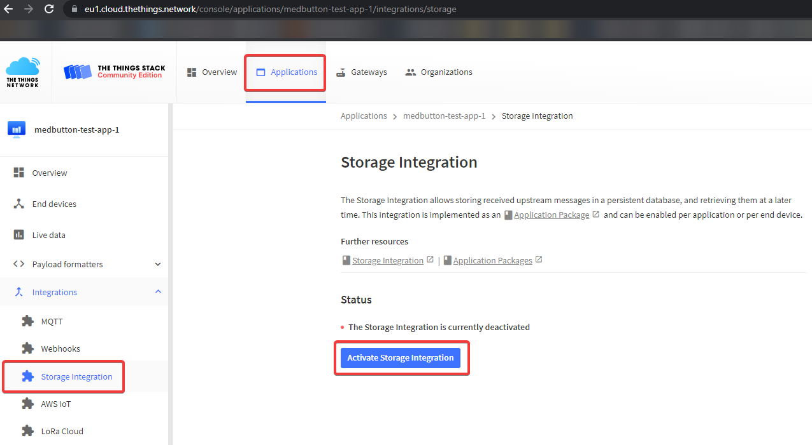
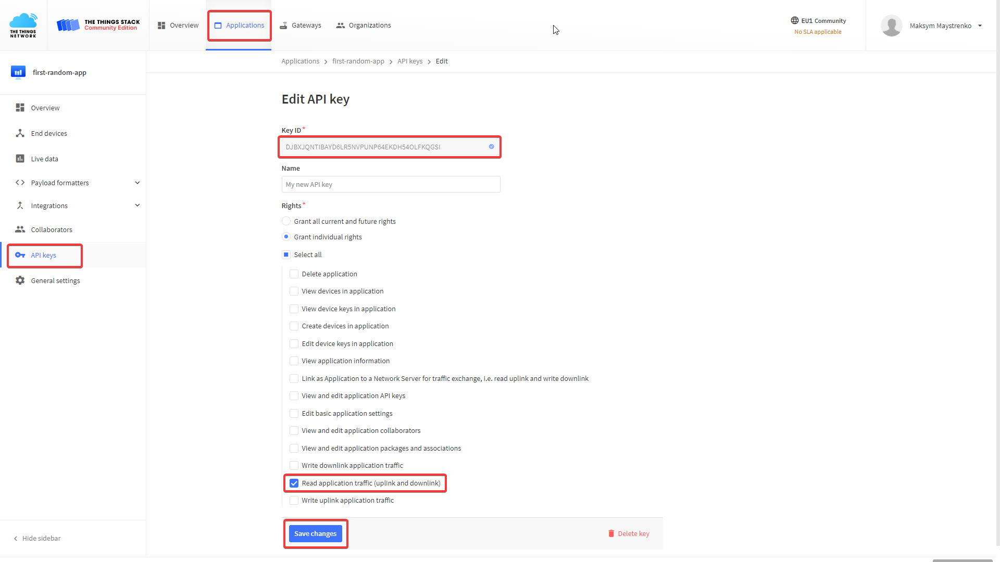

## LoRa uplink messages read from https://eu1.cloud.thethings.network/ server
This project reads most recent uplink LoRa packet for specified (in link) thethingsnetwork application.

Items needed in order to start:
1. Activate storage integration for your application

2. Generate and copy to the code API key with "Read application traffic (uplink and downlink)" right. Copy key with help of "copy" button on generation window:

3. Place SSL libraries libeay32.dll and ssleay32.dll into target exe folder (D:\Git\MedButton\software\Qt\Lora-MQTT-test\build-mqtt-test-Desktop_Qt_5_12_3_MinGW_64_bit-Debug\debug in my case). This is needed for https GET request. I've found dlls in by next paths in my Qt installation folder:
* "D:\Qt\Tools\mingw730_64\opt\bin\libeay32.dll"
* "D:\Qt\Tools\mingw730_64\opt\bin\ssleay32.dll"
